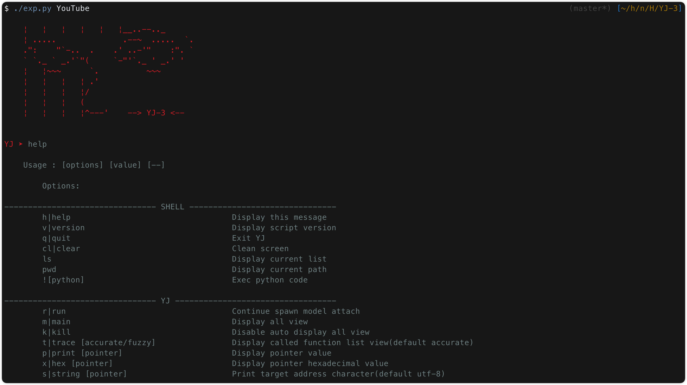
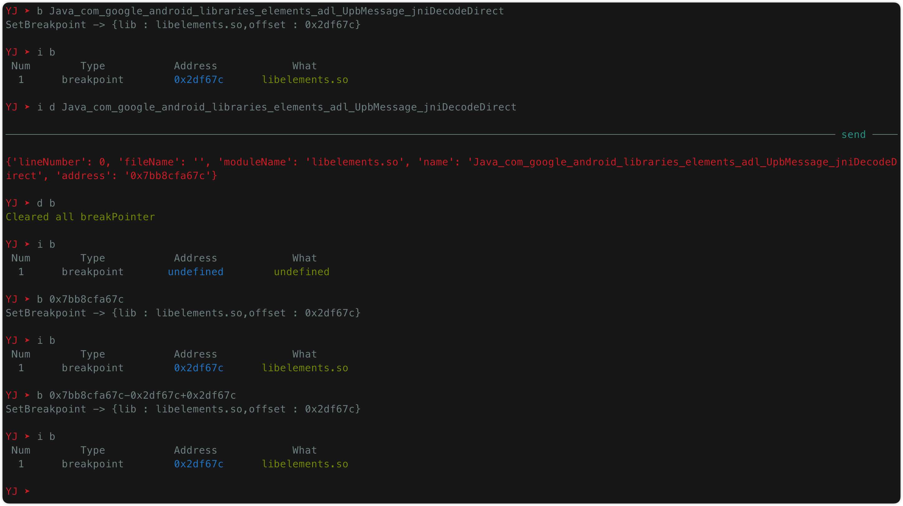
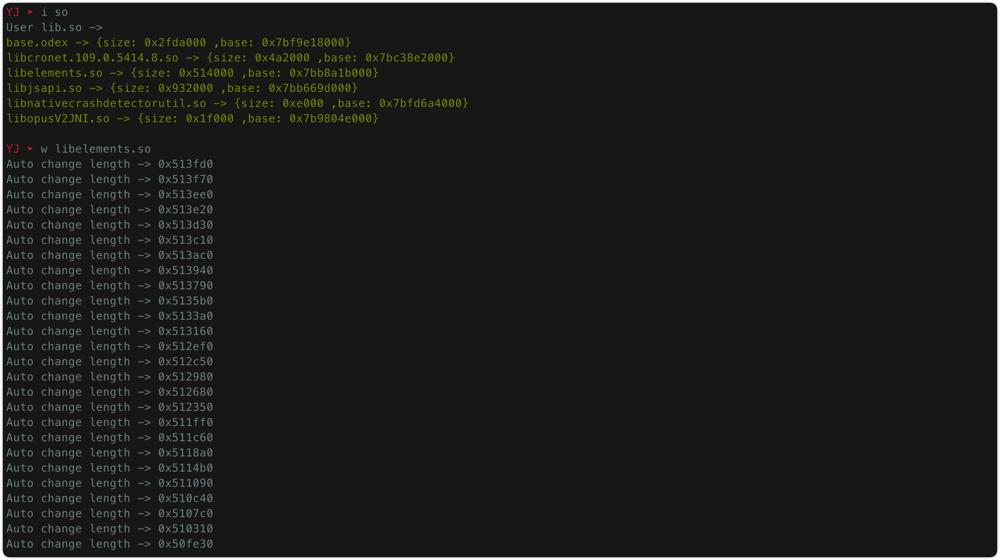
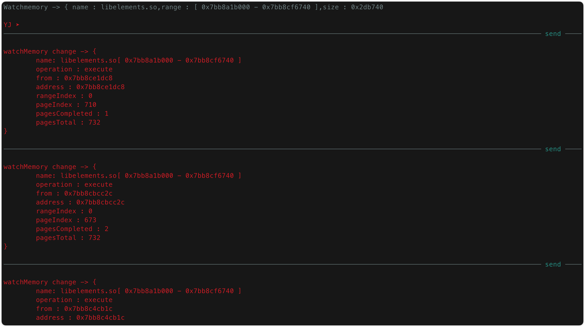
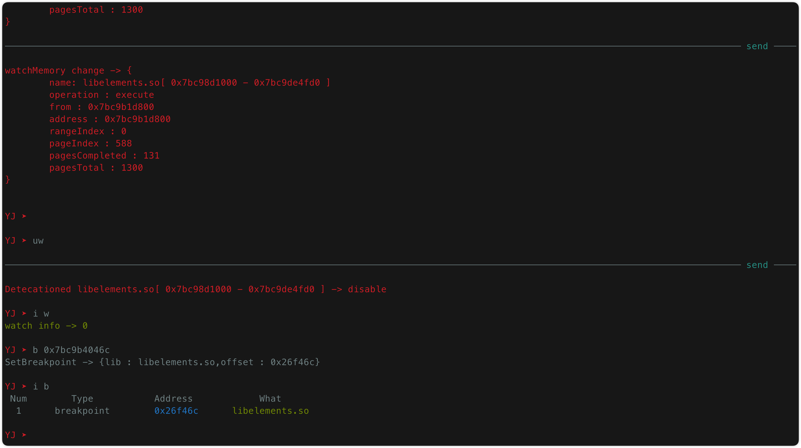
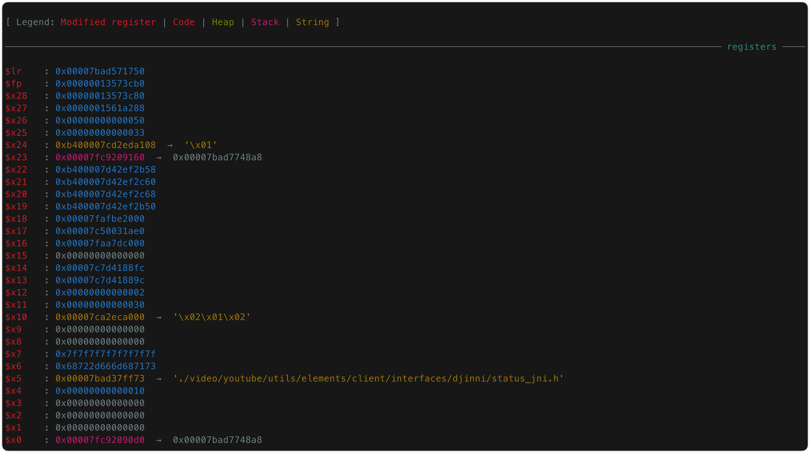
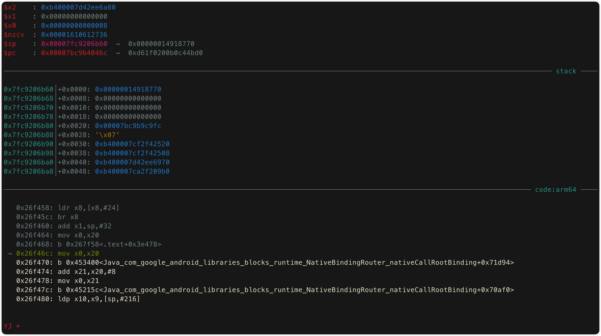
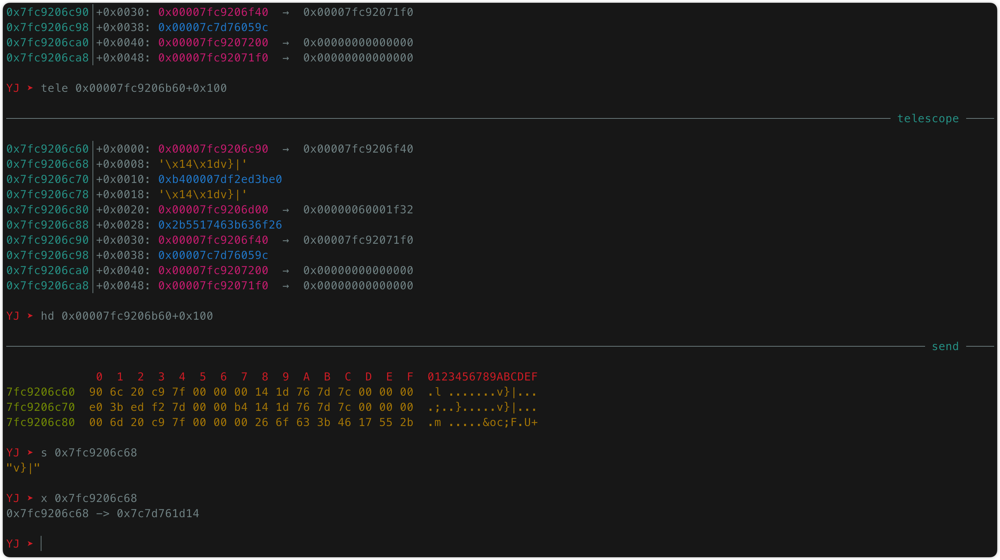
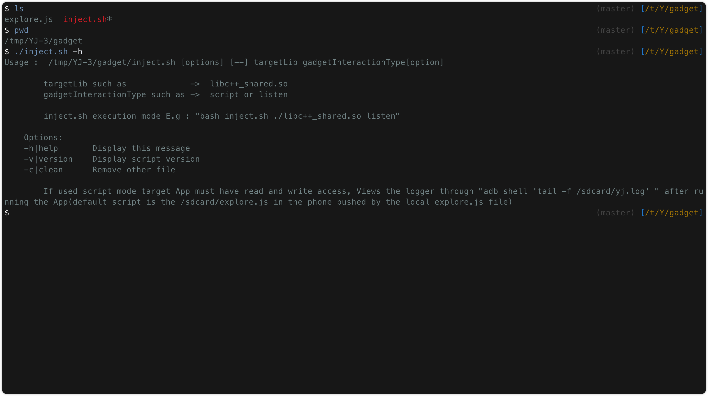

## 前言

`YJ`是一款基于Frida框架的款`Native`层逆向分析的交互式工具，就像在`GUN-LINUX`上使用`GDB`工具一样，设计`YJ`的灵感来自`GNU-GDB`调试工具，它通过交互命令模式轻松地向展示你想要窥探的内存数据

`Frida`是一个底层hook工具及框架。提供了hook工具的同时也提供了大量的API操作，基于`Frida`框架的大多都是一些对`Java`代码层的一个Hook集成，而对于`Native`层方面较为全面的分析工具很零碎

## 安装

首先你得有`Frida`,我在开发和测试阶段分别采用了`frida-15.2.2`和`frida-16.0.0`，而在完成开发的阶段已经发布了`16.0.10`,最后采用`16.0.3`是出于`16.0.0`发布的`snapshots`功能,它能提高`YJ`加载到交互界面的性能，目前该功能还在测试阶段，在不久后将会发布

```bash
pip3 install frida==16.0.0
git clone https://github.com/yang-datong/YJ-3.git
```

## 使用

通过`ADB`连接上已经开启了`frida-server`的`Android`手机

```bash
cd YJ-3
python3 exp.py [你的目标应用名称]
```



看起来有点意思，这是一个简单的`内置shell`交互模式

> 试用了一些`python`的`内置shell`库都感觉不够轻量


`YJ`提供了一些在我用`GDB`调试时的一些常见命令，具体可以看`help`命令的输出文本,默认`YJ`启动的是`attach`模式直接附加到当前的App中:
> 可以通过`python3 exp.py --help`来查看`spawn`模式来调试目标进程，或者通过`load`来加载你的脚本(默认加载脚本为`model/main.js`)


- 如果你有明确的逆向分析函数的话你可以直接使用`breakpoint [functionName]`来对目标地址下监控点(breakpoint支持对函数名、lib库名+具体偏移偏移、计算表达式下监控点，然后也可以删除当前监控点，重新监控到另一个地址)



- 如果没有明确分析具体的函数，那么可使用`watch`命令来监控具体的`lib库`内存，如下:




如果该`lib库`是个热点库，那么立马会回收到监控的内存空间具体调用信息，




找到目标地址后，`unwatch`停止内存监控，进入一下操作，通过`breakpoint [address]`对目标地址下入监控点




当地址被执行时，那么就进入到我们的内存视图（arm64的寄存器非常多，这里一整页已经装不下了）






现在可以尽情享受了，你可以通过'print'、'hex'、'telescope'、'hexdump'等命令详细的查看指定的内存数据，比如



## 无Root

对于无root设备`frida`提供了`frida-gadget`库，之前将`gadget.so`用脚本一键注入到目标进行并使`YJ`调试上去的时候发现`apktool`重新打包的性能消耗太严重,考虑到稳定性现在只保留一键注入到`lib库`中，后续的打包以及绕过操作自行处理



通过`bash inject.sh [gadgetInteractionType]`可以选择你的gadget执行的模式，如`监听模式`、`脚本模式`具体看https://frida.re/docs/gadget/

> 脚本模式中默认使用的脚本为`explore.js` 你可以在`main()`中定义你的规则

## 环境问题

电脑：目前只支持在`bash`、`python`环境中的机器，大众的来说`Mac OS`、`GUN-Linux`可用，`Windows`不可用（以后会考虑在powershell中实现类bash的功能）

手机：目前只支持Android

调试目标：目前只支持Android Native层调试，Java层无任何支持

## 后续

- 性能优化：会考虑热点功能函数使用全C实现
- 自定义插件入口：扩展功能编解码器中直接从内存抽帧
- 多平台支持：Windows
- 数据结构详细分析：堆链条、内核结构、更详细完整的内存信息

## 开源协议

!!!免责声明!!!

因为设计到了逆向安全领域，所以不得不慎重声明，本项目使用Apache License 2.0开源协议

1.授权使用者免费使用个人专利

2.使用者必须放置协议说明

3.使用者需要对修改部分声明

4.禁止用作者的名号进行商业广告

5.原作者不承担代码使用后风险

本项目仅作为学习使用，一切后果本人概不负责
