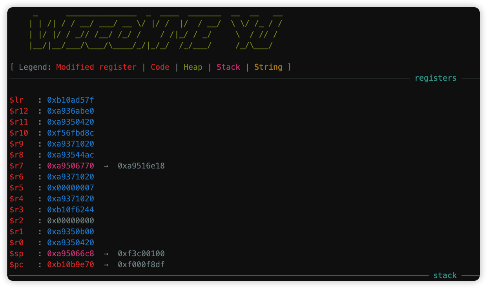
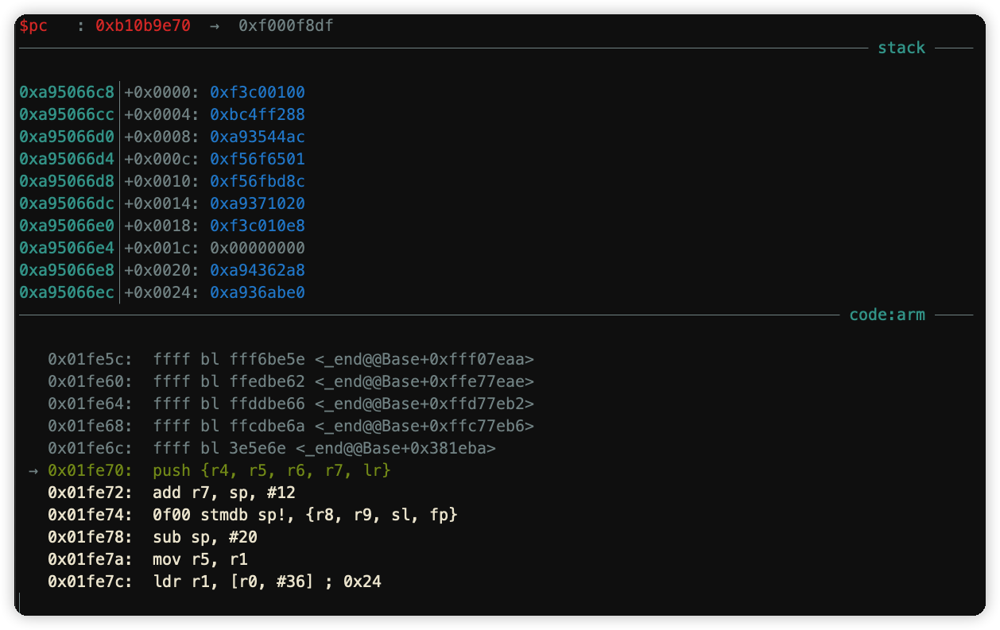

## Background

YJ is a Frida-based scripting tool, just like using GDB scripting tool on GUN, it can easily show you the memory data you want to snoop on (even if it is non-debug in App)--------------------------------------------it is inspired by GEF

It can help you make better use of Frida in so binaries

## Environment

Oh no, it's just a python script, you don't need to rely on other environments, so it works right out of the box(v1.0)

After upgrading v2.0, you need to install Linux- > objdump under Mac, which currently performs well under Mac and Linux(Windows is not tested,I think it's the same )

## Installation

```sh
~ » git clone https://github.com/github546229768/YJ.git
~ » cd YJ && chmod +x exp.py
```

## Use

**├── README.md**
**├── exp.py**
**├── frida_so.js**
**├── get_target_binary.sh**
**├── style**
**│   ├── config.json**
**│   └── layout.py**
**└── util.js**

`exp.py` -> It is a layout debugger and, of course, a script container for Frida

`frida_so.js` -> It is the core file that you use Frida to Hook the target program. You should do Hook here

`utli.js` -> It is a tool library that I use to encapsulate API, and you can extend it here

`get_target_binary.sh` -> It is used to get the disassembly code of the object file

`style-config.json` -> It is the style configuration information for the tool

`style-layout.py` -> Layout architecture for modules

`.YJ-lib.so` -> It is the target lib under the runtime dump（Will only be generated after it is run）

`.YJ-lib.so.asm` -> Reverse the assembled cache files for faster access later（Will only be generated after it is run）

## Screenshot





## Conclusion

After two days and a night's struggle, I have completed its prototype, and it will be updated in the future

